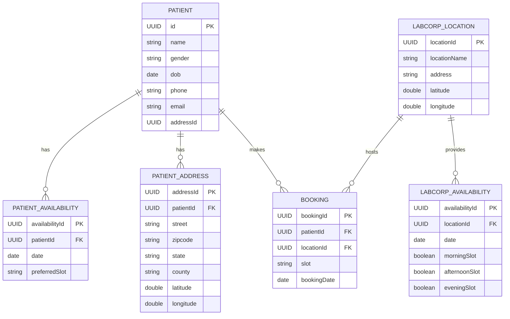
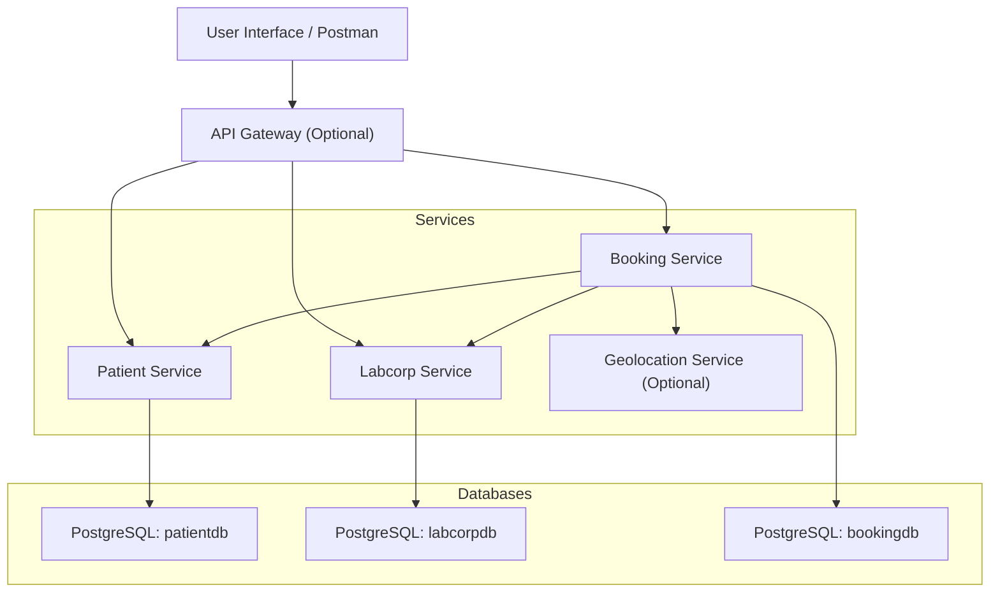
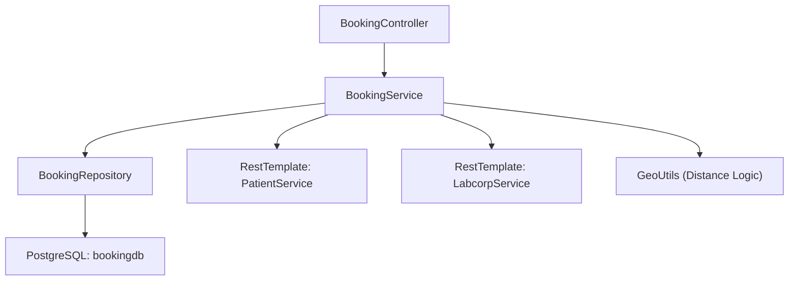

# 🏥 Labcorp Appointment Microservices – Deliverables

---

## ✅ 1. ERD Diagram

---

## ✅ 2. PostgreSQL Schema

Each service has its own DB: `patientdb`, `labcorpdb`, `bookingdb`.

Refer to previous messages for detailed `CREATE TABLE` SQL for each table with UUID PKs and check constraints.

---

## ✅ 3. C2 Architecture (Container View)

---

## ✅ 4. C4 Architecture (Component View for BookingService)

---
